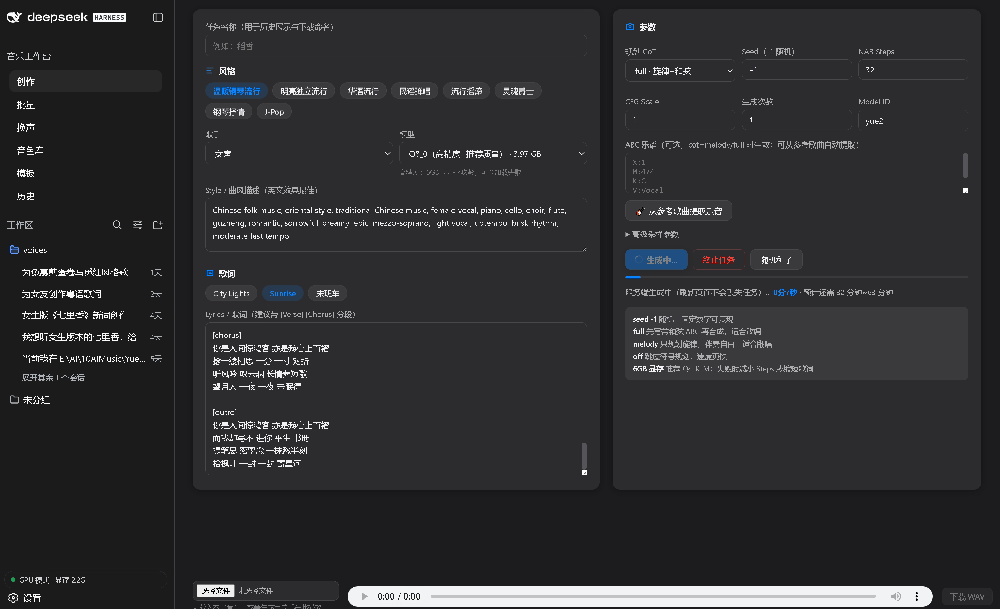
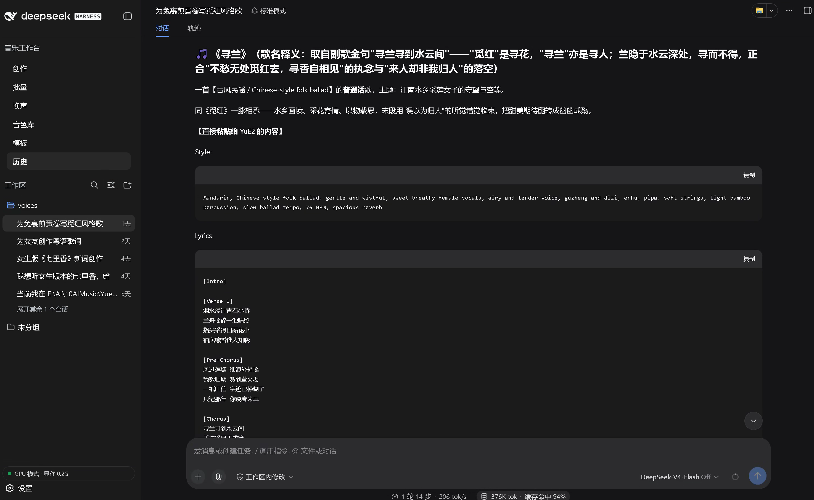
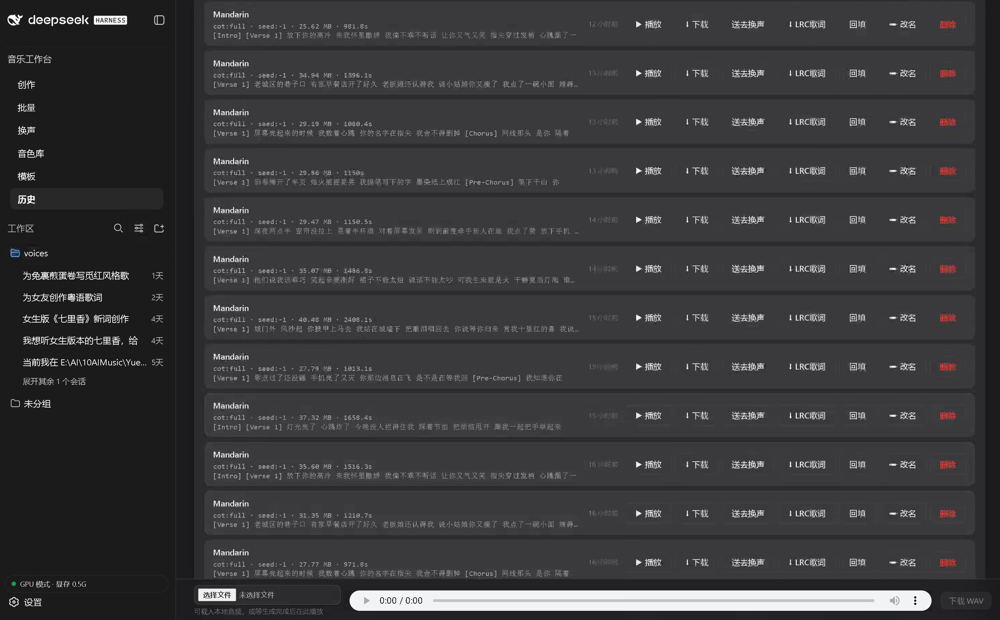
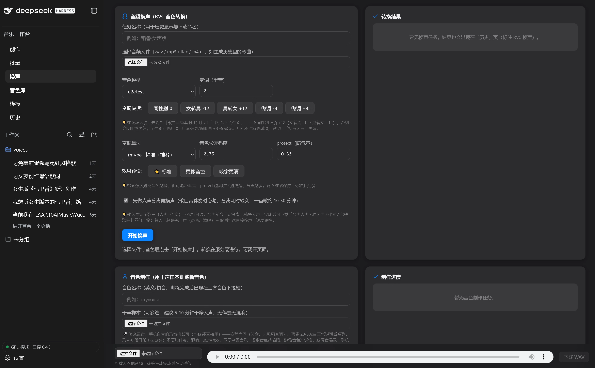
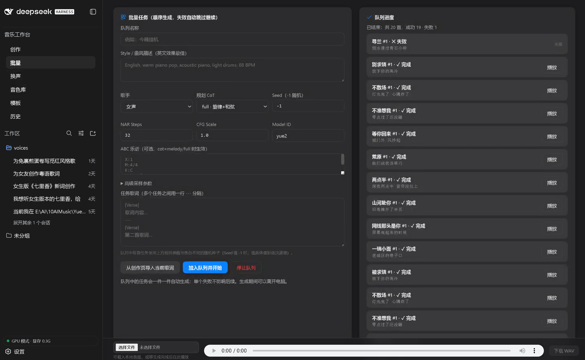
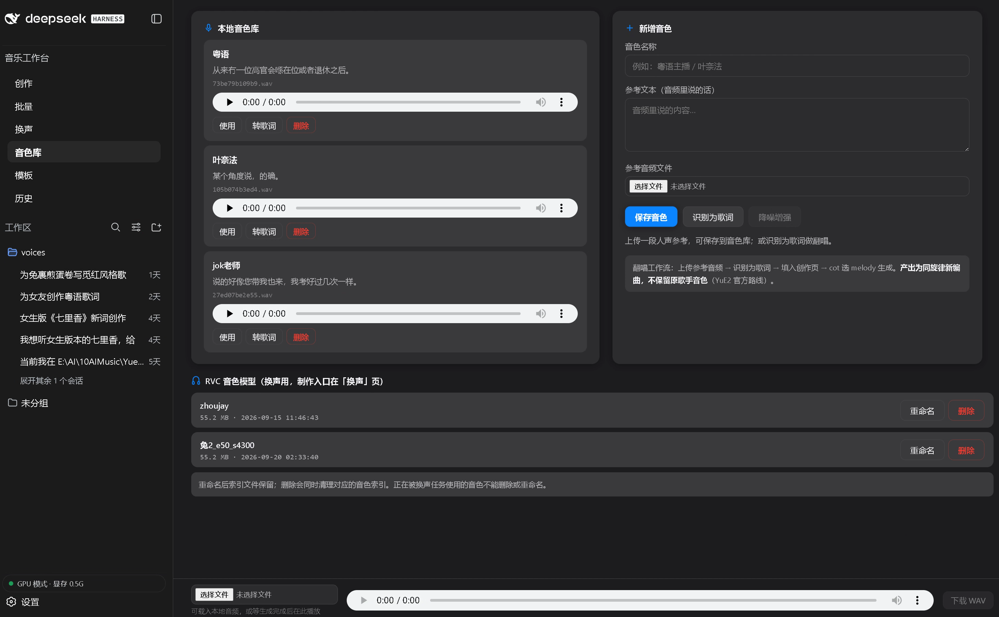
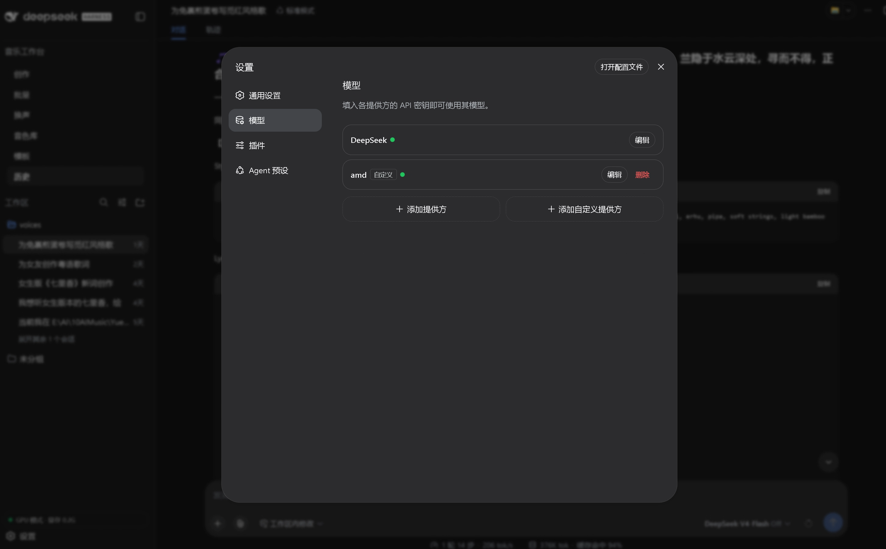

<div align="center">



# 🎵 音乐工作台 YuE2

**一键开唱 · 本地 AI 音乐生成工作站**

_写词 + 写曲 + 演唱 + 滚动歌词，全流程在你自己的电脑上完成 —— 不上传、不排队、不花钱。_

[](https://creativecommons.org/licenses/by-nc/4.0/)
[](#-三步开唱)
[](https://www.python.org/)
[](https://fastapi.tiangolo.com/)
[](#-常见问题)
[](https://github.com/ggml-org/ggml)
[](#-它能做什么)
[](#-它能做什么)
[](#-常见问题)
[](https://github.com/RevolutionLA/YuE2-Music-Workbench/stargazers)
[](https://github.com/RevolutionLA/YuE2-Music-Workbench/network/members)
[](https://github.com/RevolutionLA/YuE2-Music-Workbench/pulls)

**`YuE2 大模型`** · **`GGUF 量化`** · **`AI 翻唱`** · **`RVC 换声`** · **`LRC 滚动歌词`** · **`批量生成`** · **`大陆网络开箱即用`**

[快速开始](#-三步开唱) · [功能一览](#-它能做什么) · [界面预览](#-界面预览) · [架构](#-架构) · [常见问题](#-常见问题) · [致谢](#-致谢)

**⭐ 觉得有用就点个 Star —— 这是给独立开发者最好的鼓励！**

</div>

---

## 📖 目录

- [✨ 它能做什么](#-它能做什么)
- [🎬 界面预览](#-界面预览)
- [🚀 三步开唱](#-三步开唱)
- [🏗 架构](#-架构)
- [❓ 常见问题](#-常见问题)
- [🙏 致谢](#-致谢)
- [📄 许可](#-许可)

## ✨ 它能做什么

| | 功能 | 一句话说明 |
|---|---|---|
| 🎼 | **AI 写歌** | 输入风格 + 歌词 → 完整人声歌曲（副歌/主歌自动编排），支持改旋律（ABC 乐谱）|
| 🤖 | **AI 辅助写词写风格** | 内置 DeepSeek 驱动的创作助手：说人话，它帮你出六要素风格标签和结构化歌词 |
| 🎤 | **翻唱 / 改词 / 改曲风** | 丢一段参考音频 → 自动识别歌词 → 换词换曲风重新演绎 |
| 🗣 | **换声** | RVC 音色转换：把自己的音色变成任意歌手；完成产物含换声人声/原人声/伴奏/完整歌曲四份，下载可任选 |
| 📝 | **LRC 滚动歌词** | 歌曲生成完**自动**产出纯净 `.lrc`（faster-whisper 词级时间戳对齐，仅时间轴+歌词，无标题作者等冗余头），直接导入音乐 App |
| 🎨 | **音色制作** | 上传干声训练专属音色库 |
| 📦 | **批量队列** | 一次排队几十首挂机生成；意外中断后**一键继续**，失败条目可单条重试，网关重启自动恢复队列 |
| 🗂 | **任务管理** | 状态筛选（全部/进行中/已完成/失败）× 类型筛选（歌曲/换声/音色制作）双维组合；列表含任务名/状态/第一句歌词/时长/耗时；进行中任务可终止/重启/改名/删除 |
| 🔔 | **完成通知** | 歌曲完成/失败弹 Windows 系统通知（含任务名）；浏览器标签栏图标随任务状态变化，一眼看出忙闲 |
| 💻 | **dsh 一体化工作台** | 内嵌 DeepSeek Harness 侧栏：独立页签导航、GPU 状态按钮置顶、主题明暗实时联动、任务中 favicon 角标 |
| ⏸ | **任务托管** | 刷新页面、关掉浏览器都不丢任务，回来接着看 |
| 🩺 | **看门狗自愈** | 网关/工作台假死自动检测重启；批量队列僵尸态自动复位续跑 |
| 🖥 | **显存自适应** | 显存够走 GPU 飞快，不够自动切 CPU 兜底，完成后自动切回 |

## 🎬 界面预览

<div align="center">

### 创作主界面


### 🤖 AI 辅助写词写风格


### ⏸ 任务管理


| 🎤 换声 | 📦 批量生成 | 🎨 音色制作 |
|:---:|:---:|:---:|
|  |  |  |

### ⚙️ dsh 原生配置模型


</div>

## 🚀 三步开唱

> **Windows x64 / 16GB+ 内存 / 建议 6GB+ 显存**（无独显也能跑，自动走 CPU，慢一些）

```bat
:: 1. 下载本仓库（Green 一键解压也行）
git clone https://github.com/RevolutionLA/YuE2-Music-Workbench.git

:: 2. 双击「启动音乐工作台.bat」（根目录或 scripts/ 下均可）

:: 3. 浏览器自动打开工作台 → 填风格和歌词 → 点「生成歌曲」
```

**第一次运行会自动下载模型吗？会！** 启动脚本检测到模型缺失时，自动从 **hf-mirror.com 大陆镜像**（约 2.7GB，支持断点续传）下载 YuE2-3B GGUF 模型 + VAE，下载完直接开唱。中断了？重新双击启动脚本，接着下。

<details>
<summary><b>🌐 大陆网络加速说明（点开）</b></summary>

- 模型下载默认走 `https://hf-mirror.com`（大陆直连，无需科学上网）
- 镜像不可用时自动回退 `huggingface.co`
- 想手动指定镜像：设置环境变量 `HF_ENDPOINT=https://hf-mirror.com`
- 想手动下载 / 换量化版本（q8 更高质量约 4GB）：

```bat
py312\python.exe scripts\download_models.py          :: q4_k_m（默认，约2.7GB）
py312\python.exe scripts\download_models.py --q8     :: q8_0（约4GB，质量更佳）
```

</details>

## 🏗 架构

```
浏览器 ── 3081 一体化工作台（dsh-plugin）
              │ /lab-api/* 反代
              ▼
        7863 FastAPI 网关（app.py：任务托管/批量队列/终止/换声/音色训练/歌词对齐）
              │
              ├── 8080 audio.cpp 推理引擎（YuE2 GGUF，CUDA/CPU 自适应）
              ├── faster-whisper（LRC 词级对齐）
              ├── RVC（换声 / 音色训练）
              └── watchdog（假死自愈守护）
```

| 目录 | 内容 |
|---|---|
| `app.py` | 网关扩展路由：任务托管 / 批量排队 / 一键继续 / 终止 / 模型切换 / 换声 / 歌词对齐 |
| `src/lrc.py` | LRC 滚动歌词生成（faster-whisper 词级时间戳对齐，纯净输出仅时间轴+歌词） |
| `static/` | 创作页前端（明暗主题跟随 dsh，刷新不丢状态） |
| `dsh-plugin/` | 一体化工作台 UI 插件（侧栏页签/GPU 状态按钮/主题联动/favicon 任务角标） |
| `scripts/` | 启动/停止/模型下载脚本、ASR 与降噪辅助、`yue2workbench://` 离线协议注册 |
| `watchdog.py` | 看门狗（网关 + 工作台假死自愈，无窗口静默运行） |
| `cpp/` | YuE2 GGUF 推理引擎与模型（模型不入库，自动下载） |
| `checkpoints/` | SheetSage2 乐谱提取（含上游许可） |
| `pic/` | README 截图 |

## ❓ 常见问题

<details>
<summary><b>没有 NVIDIA 显卡能跑吗？</b></summary>

能。显存不足或无独显时自动切换 CPU 后端（速度慢约 5-10 倍），生成完成后自动切回。16GB 内存 + 现代多核 CPU 即可出歌，只是等待时间更长。
</details>

<details>
<summary><b>生成一首歌要多久？</b></summary>

full 模式（可编辑旋律 + 和声）+ 32 步 + 长歌词，6GB+ 显存约 60-90 分钟；melody / off 模式更快。支持批量排队挂机。
</details>

<details>
<summary><b>数据会上传到云端吗？</b></summary>

不会。除首次模型下载走镜像站外，写词、生成、换声、训练、歌词对齐全部在本机完成，无任何遥测。
</details>

<details>
<summary><b>生成的歌能带滚动歌词吗？</b></summary>

能。内置 faster-whisper 词级时间戳对齐，一键产出标准 `.lrc` 文件，导入网易云音乐 / QQ 音乐等 App 即可逐行滚动显示。
</details>

<details>
<summary><b>能商用吗？</b></summary>

不能。YuE2 模型权重遵循 CC-BY-NC 4.0（非商用），本项目扩展代码同样随上游许可分发。详见下方许可说明。
</details>

## 🙏 致谢

- [m-a-p/YuE2](https://huggingface.co/m-a-p/YuE2-3B) —— 音乐生成模型
- [audio.cpp](https://github.com/leejet/audio.cpp) · [GGUF 量化](https://huggingface.co/ngquocvinh/YuE2-3B-GGUF) —— 本地推理引擎
- [faster-whisper](https://github.com/SYSTRAN/faster-whisper) —— 词级时间戳，驱动 LRC 滚动歌词
- RVC / SheetSage2 / SenseVoice —— 换声、乐谱、语音识别

## 📄 许可

本仓库扩展代码随各上游组件许可分发；模型权重遵循 [m-a-p/YuE2](https://huggingface.co/m-a-p/YuE2-3B) 原始许可（CC-BY-NC 4.0，**非商用**）。使用/二次分发前请核对 `checkpoints/` 内许可与 `THIRD_PARTY_NOTICES`。

---

<div align="center">

**如果这个项目帮到了你，请点一个 ⭐ —— 让更多热爱音乐的人看到它！**

[⬆ 回到顶部](#-音乐工作台-yue2)

</div>
