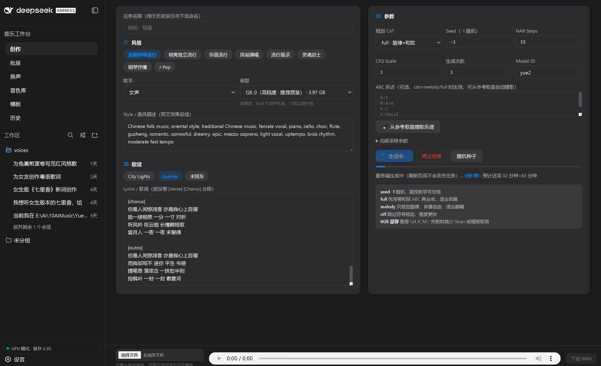
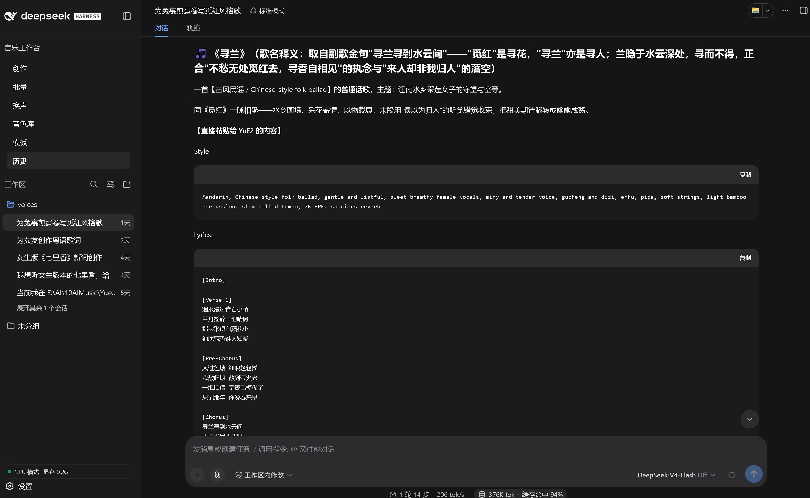
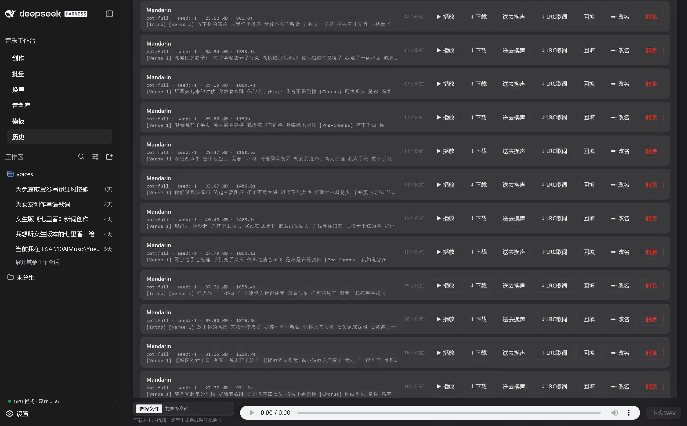
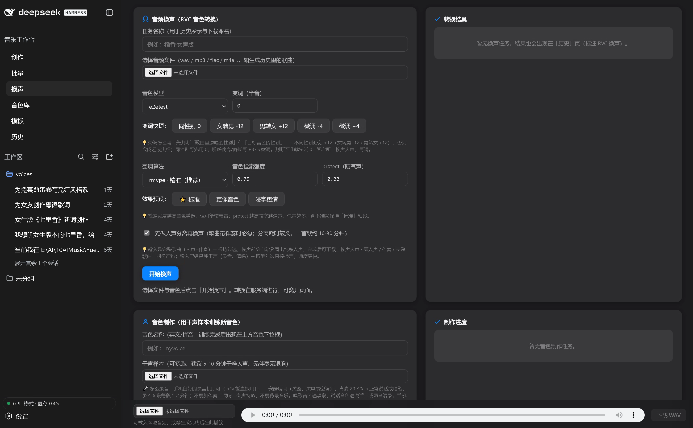
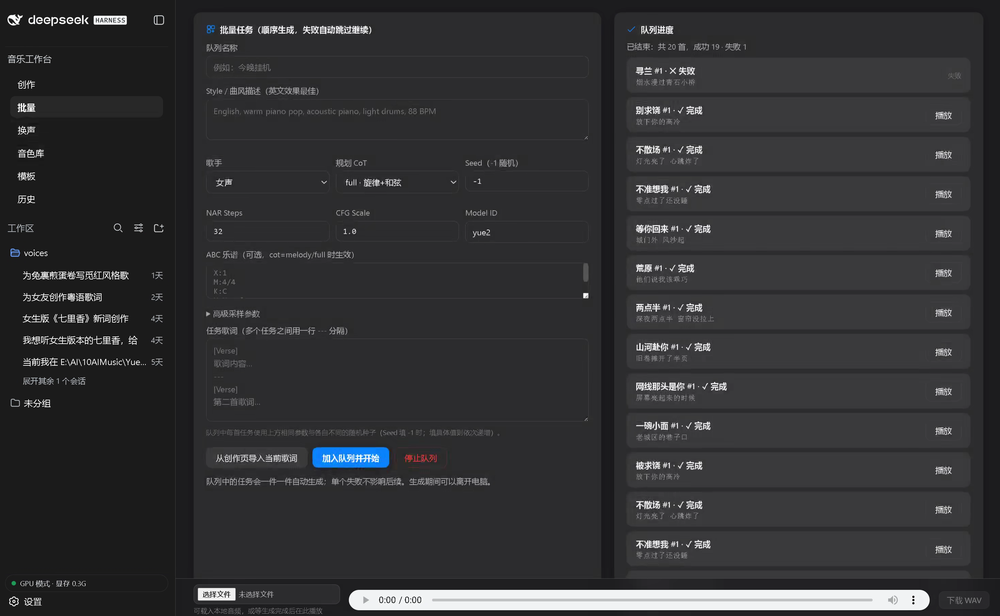
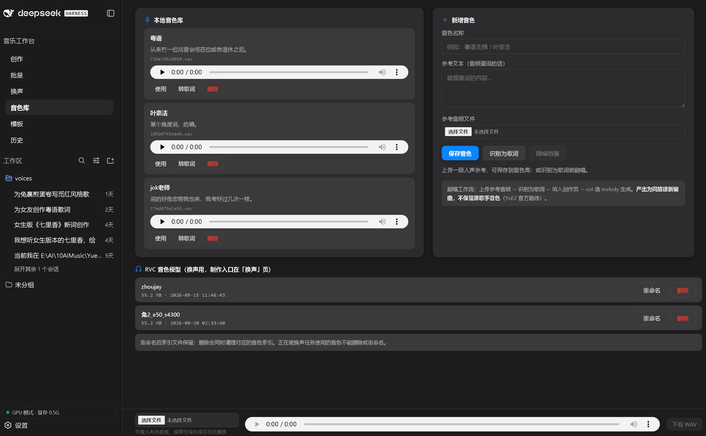
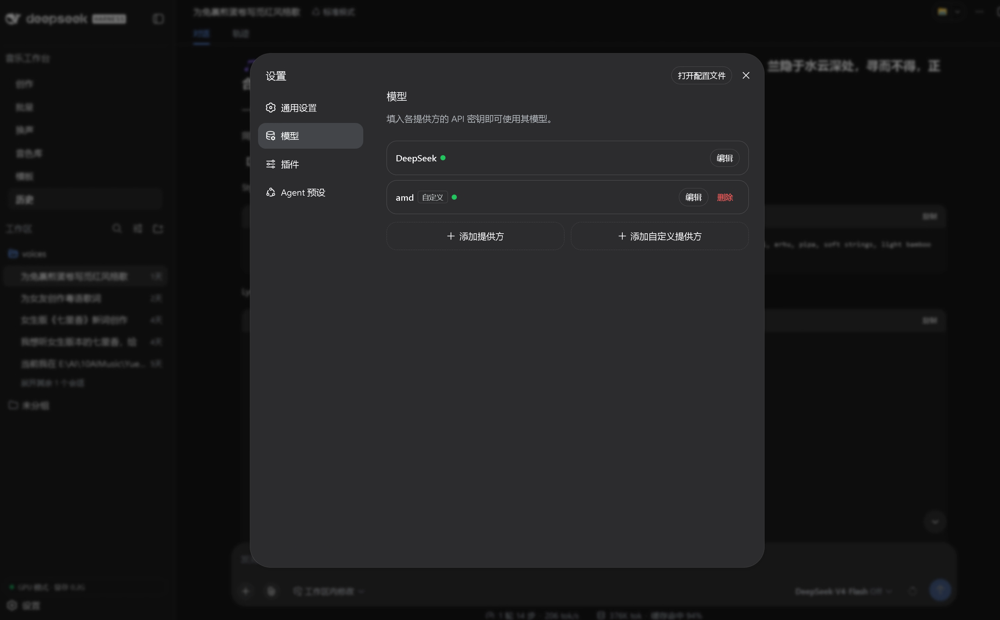

<div align="center">



# 🎵 音乐工作台 YuE2

**一键开唱 · 本地 AI 音乐生成工作站**

_写词 + 写曲 + 演唱 + 逐字卡拉OK歌词，全流程在你自己的电脑上完成 —— 不上传、不排队、不花钱。_

[](https://creativecommons.org/licenses/by-nc/4.0/)
[](CHANGELOG.md)
[](#-三步开唱)
[](https://www.python.org/)
[](https://fastapi.tiangolo.com/)
[](#-常见问题)
[](https://github.com/ggml-org/ggml)
[](#-它能做什么)
[](#-它能做什么)
[](#-常见问题)
[](https://github.com/RevolutionLA/YuE2-Music-Workbench/stargazers)
[](https://github.com/RevolutionLA/YuE2-Music-Workbench/network/members)
[](https://github.com/RevolutionLA/YuE2-Music-Workbench/pulls)

**`YuE2 大模型`** · **`GGUF 量化`** · **`AI 翻唱`** · **`RVC 换声`** · **`逐字卡拉OK歌词`** · **`批量生成`** · **`断点续跑`** · **`大陆网络开箱即用`**

[快速开始](#-三步开唱) · [功能一览](#-它能做什么) · [界面预览](#-界面预览) · [架构](#-架构) · [常见问题](#-常见问题) · [致谢](#-致谢)

**⭐ 觉得有用就点个 Star —— 这是给独立开发者最好的鼓励！**

</div>

---

## 📖 目录

- [✨ 它能做什么](#-它能做什么)
- [🎬 界面预览](#-界面预览)
- [🚀 三步开唱](#-三步开唱)
- [🏗 架构](#-架构)
- [🗂 版本与发版](#-版本与发版)
- [❓ 常见问题](#-常见问题)
- [🙏 致谢](#-致谢)
- [📄 许可](#-许可)

## ✨ 它能做什么

| | 功能 | 一句话说明 |
|---|---|---|
| 🎼 | **AI 写歌** | 输入风格 + 歌词 → 完整人声歌曲（副歌/主歌自动编排）；**贴进 ABC 乐谱就按你的谱唱**（旋律谱走 melody、带和弦走 full，档位自动配对；留空才由模型规划）|
| 🤖 | **AI 辅助写词写风格** | 内置 DeepSeek 驱动的创作助手：说人话，它帮你出六要素风格标签和结构化歌词 |
| 🎤 | **翻唱 / 改词 / 改曲风** | 丢一段参考音频 → 自动识别歌词 → 换词换曲风重新演绎 |
| 🎼🔍 | **歌曲 → ABC 乐谱** | SheetSage2 转谱：默认纯旋律谱（配 melody 翻唱），勾选「提取时带和弦」即得旋律+和弦完整谱（配 full）；和弦两种模式都会识别，勾选几乎不多花时间 |
| 🗣 | **换声** | RVC 音色转换：把自己的音色变成任意歌手；检索库按模型名精确认领，不会串到别的音色 |
| 🎤⭐ | **逐字卡拉OK歌词** | 歌词强制对齐（非 ASR 识别）：中文 FunASR 字级时间戳 + 英文 wav2vec2 CTC 对齐 + VAD 起音锚点校正，产出标准 `.lrc` 与逐字高亮的增强 `.elrc` |
| 🎨 | **音色制作** | 上传干声训练专属音色库：完整歌曲自动分离人声、**断点续跑**、训练前模型体检、多音色融合、训练过程试听；**训练前先素材体检**（时长/切片/采样率/静音比例，按实测给轮数档位与耗时预估）、显存自适应 batch、**每档独立检查点 + 逐点试听 + 选点定稿**、训完自动自检并给出**「高频噪声化（电音）」与「辅音音头（咬字清晰度）」两条判据**、**换轮数从头重训**（旧档归档、成品与索引先备份） |
| 📦 | **批量生成** | 一次排队几十首，跑完自动落盘，**中途可随时终止**；队列按"一次提交"记身份，面板不再把历史条目算进这批的总数 |
| 📥 | **历史管理** | 每首歌自动存档，随时回填参数重跑、一键下载 WAV；**每个任务一个唯一 ID**（就是落盘文件名，点击即复制），重名任务也不会认错 |
| ⏸ | **任务托管** | 暂停/续跑状态机加固：刷新页面、关掉浏览器都不丢；重启服务后**待跑队列继续跑**，遗留的在算任务按现场如实标注：只有启动时刻早于本进程的条目才说"服务重启，任务中断"，本进程内线程没回写的说"队列已停止…请重跑这一条"（点重跑即可） |
| 🩺 | **看门狗自愈** | 网关 + 工作台双进程假死检测（兼容 token 鉴权的 401 探活），自动击杀并拉起，页面卡不住；达到连败阈值后**先做一次 90 秒深探针确认**，回了话就判"慢"不判"死"（推理满载时 `/api/health` 几十秒不回话是正常的，09-26 的日志实证过误杀）；看门狗自己先起来而网关不在时，开局三轮确认——**无人监听就主动拉起，有人监听却不回话就纳入假死监控**（旧版"从未见过的服务不管"对网关是死锁：既不起也不杀）；看门狗重启的网关 stdout/stderr 落盘到 `runtime\data\logs\gateway.{out,err}.log`，自愈不再灭现场痕迹；网关**刚拉起几秒就退出**时按"启动即死"处理（配置错、依赖缺失），连击 3 次直接熔断不再空转，并在日志里点名去查 `gateway.err.log`——这类进程根本没上过端口，走"连败→深探→击杀"要 140 秒一圈且永远救不活 |
| 🧩 | **端口唯一真源** | 所有服务端口集中在 `ports.json` 一处，改端口只改一个文件；支持环境变量临时覆盖 |
| 🖥 | **显存自适应** | 显存够走 GPU 飞快，不够自动切 CPU 兜底，完成后自动切回；试听/转换前置内存闸门，与训练互不挤死 |

## 🧭 工作台有哪 13 个页面

v2.0 把原来一个"创作"页里的四件事拆开，每个环节独立成页——"我正在做哪一步"在界面上是自明的。
v10.9 再补上 ⑫ 设置与 ⑬ 关于两页。侧栏分三组：

| 组 | 页面 | 这一步在干什么 |
|:---|:---|:---|
| **创作** | ① Style 组装 | 点曲风配方与六要素，产出一段符合 YuE2 要求的 Style 文本（不生成、不播放） |
| | ② 歌词生成歌曲 | Style + 歌词 → 歌曲（含连发与批量入队） |
| | ③ 参考歌曲提取乐谱 | 上传一首歌 → ABC 乐谱，可编辑、可分析、可入库、可导出 MIDI |
| | ④ 乐谱生成歌曲 | Style + 乐谱 + 歌词 → 按谱演唱（档位与谱型自动配对） |
| | ⑧ 歌词曲风 AI 工作台 | DeepSeek 创作助手（iframe 嵌入），产出可一键回填 ① 或 ② |
| **声音** | ⑤ 音色制作 | 上传素材 → 体检 → 训练 → 逐档试听 → 选点定稿 |
| | ⑥ 音色库 | 参考音色（YuE2）与换声音色（RVC）两块库 + 导入 + 体检/音域/融合 |
| | ⑪ 歌曲换声 | 选音色 + 变调 + 参数 → RVC 换声（唯一能保住原旋律原编曲的路线） |
| | ⑦ 人声伴奏分离 | 上传歌曲 → 人声 / 去和声人声 / 伴奏，可下载、可送 ⑤⑪③ |
| **系统** | ⑨ 任务管理 | 五类任务（生成/换声/训练/转谱/分离）的统一视图 + 队列 |
| | ⑫ 设置 | 服务与模型校验、模型档位切换、引擎模式、外观主题色、维护（改配置仍建议改文件） |
| | ⑬ 关于 | 系统信息（端口 / 目录 / 磁盘显存 / 引擎就绪，只读）+ 出处、许可与诚实声明 |

**②④ 共用同一个生成面板、③④ 共用同一个 ABC 编辑器**——切页签只是把同一份 DOM 搬到目标页
（`static/index.html: switchTab` / `moveInto`），所以不存在"两个页面参数不一致"的问题。
v1.x 的书签（`#compose` 等）会自动跳到对应新页，不用手动改。

## 🎬 界面预览

<div align="center">

### 创作主界面


### 🤖 AI 辅助写词写风格


### ⏸ 任务管理


| 🎤 换声 | 📦 批量生成 | 🎨 音色制作 |
|:---:|:---:|:---:|
|  |  |  |

### 🎤 换声（RVC）的四份产物与三条口径

一次换声（勾了「先做人声分离」）落四份盘，页面上**成品与干声分别有点播按钮**，不会再让人误把
半成品当成品听：

| 产物 | 是什么 | 接口 |
|:---|:---|:---|
| 成品（带伴奏） | 换声人声 + 分离出的伴奏混回，保留伴奏的立体声 | `GET /api/rvc/audio/<ID>?part=full_song` |
| 换声人声（干声） | 只有换声后的人声，主产物，也是 `part` 留空时的默认 | `GET /api/rvc/audio/<ID>` |
| 原人声 / 伴奏 | 分离链路的中间产物，供自己在 DAW 里再加工 | `part=vocals_original` / `part=accompaniment` |

三条口径值得知道，它们都是实测出来的：

- **静音门（默认开）**：RVC 对"没有人声的片段"并不会输出静音。实测一首 221 秒的歌，前 28 秒
  原人声是数字零，换声结果却顶着 -26dB、主频 279Hz 的恒定蜂鸣——听起来就是"前奏底噪特别大"。
  现在以真正送进 RVC 的那个人声的包络为准，把没人声的片段压到 -60dB（实测该段
  -26.8dB → -86.8dB，人声段逐帧增益变化中位数 0.0dB，即不吃唱）。
- **protect 的方向与直觉相反**：它是"非乐音帧里保留多少原唱特征"的权重，**数值越小越保留
  原唱的清辅音与呼吸（电音更少），拉到 0.5 等于完全不保留**。副歌有叠唱/和声时，和声会让
  音高跟踪在高音处跳轨出电音——勾「分离后再去和声（HP5）」只留主唱。
- **连点不会并行，会排成队**：换声一次只跑一个任务，后提交的显示「⏳ 排队中（第 N 位）」，
  前面的算完自动轮到它；排队中的条目可以给「✕ 取消排队」，已经开始转换的不能取消（RVC 是
  一个子进程从头算到尾，半途掐掉只会留下坏文件）。为什么必须串行：显存只是一半，另一半是
  人声分离——以前连点两次就是两份 BS-Roformer 同时进显存（分离跑在推理信号量之外），而第二
  条明明在等锁却显示"转换中"、画着进度条。现在分离也占一次 `_GPU_SEM`，队列里的换声不会
  撞上正在生成的歌曲；反过来占着 GPU 的活儿没干完时，排到队的换声仍然老实显示"等待本机空闲"，
  不会提前给自己挂上"转换中"和进度条。队列在网关进程内，**重启后排队条目会丢**（产物只在
  算完时落盘，所以不会留下半截文件）。

### 🎨 音色制作（RVC 训练）的四条实测口径

训一个能听的音色，难的不是点按钮，是"不知道还要等多久"和"训完了不知道好坏"。这一轮把这两件事
换成实测数据：

- **先体检素材，再决定训多久**：`POST /api/rvc/train/check` 会在上传阶段就报出总时长、预估切片数、
  采样率分布与静音占比（RMS 口径，不是 VAD），并按素材时长给出建议轮数档位。实测 35 秒的合成素材报
  9 个切片，与 `preprocess.py` 真实切出的 9 个一致。
- **耗时只报本机测出来的数**：预估来自上一轮训练的真实节奏（`_rvc_epoch_rate`），本机还没跑完过
  一次训练时明说"按 240 秒/轮保守估计"，不拿公式装事实。`batch_size` 同样按显存推导
  （6GB→3、16GB→8），CPU 与显存未知的情况回落到 4 并在卡片上写明原因。
- **训完自己听一遍，而且要说清有没有听出问题**：训练结束后自动抽出成品小模型、用**自己的训练素材**
  跑一次 CPU 推理产出试听，并把 `train.log` 里的 loss 首尾对比一起写进任务卡。loss 现在按**中位数**
  统计并跳过第 1 轮的冷启动值——原先用均值，第一次 `loss_disc` 那根 2.9e9 的尖峰能把整段趋势带成假的。
  自检不再只看"能不能出声"：素材与产物各测一次 8–16kHz 谱平坦度（只在确认在唱的帧上算，静音段的
  平谱会被误读成高频毛刺，这个坑踩过），**另外数一次 3–8kHz 的辅音音头/秒**——"吐字不清"是能量被
  摊平，总高频能量只差 0.8dB、平坦度完全绿，只有音头数看得见（筛帧时只按响度，齿音本来就是清音）。
  产物明显比素材更"碎"或音头掉到 75% 以下，就在卡片上打 ⚠ 并说人话——
  「听起来发沙/有电音，锅多半在模型或素材，不在换声参数」「咬字发糊，换更练够轮的档位定稿」。等锁期间不写在算、没拿到 GPU 不写 running，
  这条规矩在训练流程同样生效。
- **检查点真的要留档**：训练命令带 `-l 0`，每档存成独立的 `G_{步数}.pth`（本机 30 轮实测存出
  G_60/G_80/G_120）。此前是 `-l 1`，100 轮全写在同一个 `G_2333333.pth` 里就地覆写——页面上的
  "逐点试听/选点定稿"看起来有 4 档，实际只有最后那一档，等于没有。现在剪枝按分位留**最终 + 约 50% +
  约 25% + 约 50% + 约 75%** 四档（练过头要到中途那几档才听得出来，原先"留最近 2 个"恰好把中段全删了；
  25% 这一档是 10-03 重训实测「越练越脏」之后当场补的），下拉框里显示
  「第 45 轮」而不是让人猜步数。一个目录只用一种制式：目录里只剩旧 `G_2333333.pth` 的音色继续按老办法
  走，避免自动续跑按文件名排序时读错档。
- **换个轮数重训**：`POST /api/rvc/train/resume/{rid}` 现在收 `epochs` 与 `restart=yes`——不必重新上传
  素材就能少练几轮重来。重训会把旧检查点整体移进 `logs/<音色>/ckpt_archive/`（移动不是删除），
  `train.log`/tfevents 一并归档（否则卡片会显示"第 100 轮 / 共 60 轮"这种谎话，判活也会被上一轮的时间戳顶着），
  成品 `.pth` 与检索库 `.index` 在被覆盖前先各存一份到任务目录的 `before_rerun/`。不带 `restart` 的续跑
  仍只允许把轮数往上调，想调少就 400 并给出路。重训一开始还会清掉**上一轮留在卡片上的结论**（自检、
  损失、检查点列表、试听样片——样片挪进 `before_rerun/` 不删），否则练到第 6 轮时页面显示的仍是昨天
  练满 100 轮那份的判定，档位下拉框里写着已经归档走的名字，点了必然 404。

检索库（`.index`）现在**按模型名精确挂**，不再靠子串猜。RVC 原生是递归扫目录 + 前缀模糊匹配，
实测本机「王菲」的换声一直在用「王菲V6」的 index（按文件名排序时 V6 的候选先被命中）——两个音色
听起来一模一样，一半原因是这个。现在提交换声会先把 index 对不上号的音色挡下来，转换命令里显式
带 `--index <自己的那份>`，`index_rate=0` 也不再被吞成默认值。

### ⚙️ dsh 原生配置模型



</div>

## 🚀 三步开唱

> **Windows x64 / 16GB+ 内存 / 建议 6GB+ 显存**（无独显也能跑，自动走 CPU，慢一些）

```bat
:: 1. 下载本仓库（Green 一键解压也行）
git clone https://github.com/RevolutionLA/YuE2-Music-Workbench.git

:: 2. 双击「启动音乐工作台.bat」（根目录或 scripts/ 下均可）

:: 3. 浏览器自动打开工作台 → 填风格和歌词 → 点「生成歌曲」
```

> ⚠️ **诚实说明：`git clone` 只拿到工作台代码，拿不到运行时二进制。** 下面这几件因体积与上游许可不入库（见 `.gitignore`），缺任何一件都起不来，需从完整分发包（Green 版）或各自上游获取后放到指定路径：
>
> | 不入库的东西 | 放到哪 | 从哪来 |
> | --- | --- | --- |
> | `py312/`（Python 3.12 运行环境 + 全部依赖） | 仓库根 `py312/` | 自备 Python 3.12 环境（本仓库**没有**根 `requirements.txt`，依赖清单以分发包为准；`checkpoints/requirements*.txt` 只覆盖转谱那一块） |
> | `main.cp312-win_amd64.pyd`（编译网关内核） | 仓库根 | 随 YuE2 引擎分发包提供，**本仓库不含、也不得二次分发** |
> | `cpp/`（`audiocpp_server.exe` 推理引擎 + `server.json`） | 仓库根 `cpp/` | 同上；GGUF 模型可用 `scripts/download_models.py` 自动下载 |
> | `checkpoints/model.safetensors`（SheetSage2/MERT2 权重） | `checkpoints/` | 从 `m-a-p/MERT-v2-30s` / `MERT-v2-FullSong` 手动下载放入（转谱功能必需，其余功能不受影响） |
> | `runtime/models/`（本地 ASR/对齐权重，约 1.6GB） | `runtime/models/` | 歌词逐字对齐功能按需放置；不做逐字对齐可以不管 |
>
> 缺上面任何一件时，对应功能会在启动或用该功能时报明确错误，而不是静默降级。也就是说：**这条"三步开唱"路线目前只对拿到完整分发包的人成立**；纯 clone 用户需要自己补齐上面五行。这一限制已记录在 `docs/review/RESPONSE-308f833.md`（蓝军 D1），不是文档笔误。

**第一次运行会自动下载模型吗？会！** 启动脚本检测到模型缺失时，自动从 **hf-mirror.com 大陆镜像**（约 2.7GB，支持断点续传）下载 YuE2-3B GGUF 模型 + VAE，下载完直接开唱。中断了？重新双击启动脚本，接着下。

<details>
<summary><b>🌐 大陆网络加速说明（点开）</b></summary>

- 模型下载默认走 `https://hf-mirror.com`（大陆直连，无需科学上网）
- 镜像不可用时自动回退 `huggingface.co`
- 想手动指定镜像：设置环境变量 `HF_ENDPOINT=https://hf-mirror.com`
- 想手动下载 / 换量化版本（q8 更高质量约 4GB）：

```bat
py312\python.exe scripts\download_models.py          :: q4_k_m（默认，约2.7GB）
py312\python.exe scripts\download_models.py --q8     :: q8_0（约4GB，质量更佳）
```

</details>

<details>
<summary><b>🔧 想改端口？（点开）</b></summary>

所有服务端口集中在仓库根的 `ports.json`，改完重启生效：

```json
{
  "gateway": 7863,    // FastAPI 网关
  "dsh": 3081,        // 工作台 UI
  "audiocpp": 8080    // 推理引擎
}
```

也可用环境变量临时覆盖（优先级更高，便于排障/并行实例）：
`YUE2_GATEWAY_PORT` / `YUE2_DSH_PORT` / `YUE2_AUDIOCPP_PORT`

文件缺失或写坏时自动回退默认端口——配置问题绝不会导致服务起不来。

</details>

## 🏗 架构

```
浏览器 ── 3081 工作台 UI（dsh-plugin，UI 唯一入口）
              │ /lab-api/* 反代
              ▼
        7863 FastAPI 网关（app.py：纯 API，任务托管/批量/换声/音色训练/歌词对齐）
              │
              ├── 8080 audio.cpp 推理引擎（YuE2 GGUF，CUDA/CPU 自适应）
              ├── src/lrc_align.py 歌词强制对齐（FunASR / wav2vec2 CTC / VAD 锚点）
              ├── RVC（换声 / 音色训练：分离人声、断点续跑、融合、试听）
              └── watchdog（双进程假死自愈守护）
```

> 🧱 **`app.py` 外面这一层是全部可改代码，里面那层不是**：`app = main.app`，`main` 就是编译好的 `main.cp312-win_amd64.pyd`（不可读源码、不可改）。`/api/music/generate` 这类内核路由由它提供，本项目的路由挂在它外面一圈（`router` 前缀 `/api`），并直接重排 `app.routes` 保证自家端点先匹配。想改生成行为却改不动时，先确认你要改的东西在内核里还是在这一层——`audiocpp.py` 是内核运行期真正依赖的引擎适配层（可改），别当成死代码。

> 🔩 **端口唯一真源**：`ports.json` 一处配置，Python（settings/app/watchdog）、Node（dsh-plugin）、bat 启动脚本全部同源读取。

| 目录 | 内容 |
|---|---|
| `app.py` | 网关扩展路由：任务托管 / 批量排队 / 终止 / 模型切换 / 换声 / 歌词对齐 / 本机接口守卫 |
| `main.cp312-win_amd64.pyd` | **编译网关内核（不可改、不入库）**，`app.py` 通过 `import main` 取得 `app` 并在其外挂路由 |
| `audiocpp.py` | 内核运行期真正依赖的推理引擎适配层（可改，改引擎调用参数在这里） |
| `src/lrc_align.py` | 歌词强制对齐引擎（字/词级时间戳 → LRC + 增强 ELRC 卡拉OK逐字高亮） |
| `src/ports.py` | 端口唯一真源（ports.json 读取 + 环境变量覆盖 + 缺失回退） |
| `ports.json` | 服务端口配置（改端口只改这一处） |
| `static/` | 工作台前端（13 个页面，明暗双主题，刷新不丢状态） |
| `dsh-plugin/` | 工作台 UI 插件（3081 唯一 UI 入口） |
| `scripts/` | 启动/停止/模型下载/dsh 工作台启动脚本、ASR 与降噪辅助 |
| `watchdog.py` | 看门狗（网关 + 工作台双进程假死自愈，无窗口静默运行） |
| `cpp/` | YuE2 GGUF 推理引擎（`audiocpp_server.exe` + `server.json`）与模型目录；**引擎与模型都不入库**，GGUF 模型可用 `scripts/download_models.py` 自动下载 |
| `checkpoints/` | SheetSage2 乐谱提取（含上游许可；纯旋律谱 / 旋律+和弦完整谱两档） |
| `tests/` | 回归用例（`py312\python.exe -m pytest tests -q`，纯本机文件/参数校验，不跑任何 GPU 计算） |
| `LICENSE` | 分层许可声明：自研代码随上游 CC BY-NC 4.0，含第三方随仓资产清单 |
| `pic/` | README 截图 |

## 🗂 版本与发版

**版本号规则（v10 起，日期版）**：`主.日.序` —— 主版本固定 `10`，第二段是**发布当天的日**，
第三段是**当天第几次发**（从 `0` 起）。例：2026-10-09 首发 → `10.9.0`，同日再发 → `10.9.1`，
次日 → `10.10.0`。`v2.0.0` 及更早为语义化版本（`v主.次.修订`）。
**唯一真源是 git 附注标签**：`git tag -l -n` 看全量，[CHANGELOG.md](CHANGELOG.md) 看每个版本做了什么。当前基线：

| 标签 | 含义 |
| --- | --- |
| `v1.0` | 首个开源版本（历史起点，不回溯修改） |
| `v1.1.0` | 唯一任务 ID + 和弦防呆配对 + 三轮对抗评审整改 + 授权重启冒烟验证 |
| `v1.1.1` | LAN 模式走 dsh 代理的真实路径修通（守卫放行回环 Host、Origin 端口含工作台、CORS 纳入白名单）+ 看门狗"启动即死"熔断 |
| `v1.3.0` | RVC 最佳实践落地与评审整改（J1–J4 / K1） |
| `v1.3.1` | 净化链 NaN→静音事故三处守卫：cuDNN 关闭通道、静音判定与 CPU 重跑、空切片诊断 |
| `v1.4.0` | 局域网开放：portproxy + 面板鉴权闸门 + 事件循环卸载重活 + 两处击杀误伤修复 |
| `v1.4.1` | RVC 伴奏跟随转调：非八度分量折 ±6，整八度保持原调 |
| `v1.7.0` | RVC 音色制作真留检查点 + 电音归因指标 + 重训通道 + 长跑中断 / 看门狗收口（含 v1.5.0 / v1.6.0 未单独打标签的部分） |
| `v1.7.1` | 音质体检加「辅音音头/秒」这一维（吐字不清=第二种病，谱平坦度看不见） |
| `v2.0.0` | **工作台拆成 11 页**：②④ 共用生成面板、③④ 共用 ABC 编辑器；新增 ⑦ 分离独立页、⑩ 设置页、⑥ 音色导入、⑨ 统一任务视图、⑧ 产出回填；325 条测试全绿 |
| `v10.9.0` | **数据密集改版（13 页）**：整站换 GitHub 数据密集配色去 AI 味、模块分界与组件可识别性重做、新增 ⑬ 关于页（系统信息 + 出处）、修掉 ⑤"只接受 model/ 纯文件名"的模型切换缺陷；394 条测试全绿 |
| `v10.9.1` | **布局对齐打磨**：⑪ 任务管理统一为五列骨架（行高从 72/168 两种收敛为唯一 72）、② 曲风框 540→78px、歌词框 100→394px、⑬ 系统信息 33 行平铺→4 组两列、`scrollbar-gutter: stable` 消除切页 5px 横跳；另修 `#tab-ailab` 魔法数算错 26px 与页脚文案无声截断两个真缺陷；410 条测试全绿 |

**发版清单**（打 tag 前逐项过，缺一条就只能说"代码已改"，不能说"已生效"）：

1. `py312\python.exe -m unittest discover -s tests` 全绿；
2. **重启网关后跑冒烟**——常驻进程不重启看不到新逻辑。冒烟三件：① 追加排队（新条目并入同一 `queue_id`，总数只增不减）；② 停止/取消（pending 转 `cancelled`，正在算的那条**不被轮询代写**"服务重启"）；③ 输入超上限回 400、跨站 Origin 回 403；
3. README 中英文与 `docs/PROMOTION.md` 的行为描述同步（本项目规矩：改行为必改 README）；
4. `git tag -a v<主>.<日>.<序> -m "..."` 后推标签：`git -c http.proxy=http://127.0.0.1:7890 push origin --tags`。

## ❓ 常见问题

<details>
<summary><b>没有 NVIDIA 显卡能跑吗？</b></summary>

能。显存不足或无独显时自动切换 CPU 后端，生成完成后自动切回。16GB 内存 + 现代多核 CPU 即可出歌，只是等待时间更长。**诚实的限制**：CPU 慢多少没有本机基准数据，社区经验值约 5-10 倍，请以你自己的实测为准（同一歌词多次生成波动可达 ±40%，单点数字本来就不可信，页面因此显示区间而非精确 ETA）。
</details>

<details>
<summary><b>生成一首歌要多久？</b></summary>

full 模式（可编辑旋律 + 和声）+ 32 步 + 长歌词，6GB+ 显存约 60-90 分钟；melody / off 模式更快。支持批量排队挂机。
</details>

<details>
<summary><b>数据会上传到云端吗？</b></summary>

不会。除首次模型下载走镜像站外，写词、生成、换声、训练、歌词对齐全部在本机完成，无任何遥测。
</details>

<details>
<summary><b>歌词对齐为什么不是"识别"出来的？</b></summary>

老方案用语音识别（ASR）反推时间轴，但歌声上 ASR 漏识率高达 20-30%（实测错得离谱），误差逐级累积。新方案走**强制对齐**路线：歌词文本是已知的，直接把已知歌词"压"到音频上——中文走 FunASR 字级时间戳，英文走 wav2vec2 CTC 对齐，最后用 VAD 人声起音点做锚点吸附消除集体漂移。字/词级误差在百毫秒量级，同时产出行级 `.lrc` 与逐字 `.elrc`（卡拉OK逐字高亮）。诚实的边界：逐字高亮由**支持 eLRC 的外部播放器**渲染，工作台自己的页面只放音频 + 提供两种下载，不在页面内做逐字滚动。
</details>

<details>
<summary><b>贴了 ABC 乐谱，为什么唱的还是模型自己编的旋律？</b></summary>

乐谱框里有谱 = 按谱生成，这已经不需要你手动配合「规划 CoT」下拉框了：工作台会在提交前**双向**核对口径——**只有旋律声部的谱走 `melody`**（伴奏自由），**带和弦记号的谱走 `full`**（旋律+和声都按谱），档位选反了会被纠正（引擎不会替你改写谱面：`melody` 不会自动删掉谱里的 `"C"`、`"Am7"`，`full` 也不会替你补和声），选了 `off` 同样会被纠正回按谱路线（`off` 带谱会被引擎直接判 400）。之所以要分这两条：外部 ABC 是绕过符号规划器当条件喂进去的，但 `melody`/`full` 是两套不同的原生指令，路线和谱的形态不符就属于口径不符，谱面条件就会走偏——听起来像"没按我的谱唱"。乐谱框下面会实时显示这份谱有没有和弦、将走哪条路线；提交后 toast 提示本次实际路线，历史存档里记的也是实际路线。

「🎸 从参考歌曲提取乐谱」默认给**纯旋律谱**（配 `melody`，翻唱最常用）；勾选旁边的「提取时带和弦」就得到**旋律+和弦完整谱**（配 `full`，和声也一起锚住）。和弦在两种模式下都会被识别，勾选几乎不多花时间。诚实的限制：完整谱的和弦记号要过 SheetSage2 的记号表，遇到它不认的和弦性质会**整份 ABC 导出失败**（不会静默给你一份旧谱，报错里写明原因）——遇到这种情况取消勾选重提一次即可。

注意：按谱生成只锚定旋律走向（`full` 还锚和声），不会保留原曲歌手的音色与原编曲。
</details>

<details>
<summary><b>任务重名了怎么分清是哪一次？队列名字为什么和这次提交的不一样？</b></summary>

每个任务都有一个**全局唯一 ID**（形如 `20260926_183413_64c31a01`：创建时刻 + 32 位随机），任务名可以随便重复，ID 不会。它同时就是落盘文件名（`runtime/output/<ID>.wav/.json/.lrc`、换声与音色训练目录、乐谱存档），所以报障、删除、重跑都能精确定位到一次任务，不会误伤同名兄弟。历史页/换声列表/音色训练卡片/生成进度条上都直接显示 ID，点一下即复制。

批量队列另有**一层队列 ID**，代表"一次提交"：投 2 首就是这 2 首的队列，面板只显示这一批的 `完成/总数`，之前跑过的条目单独计为"历史队列记录"，不再混进当前总数。往**还在跑**的队列里追加时，新任务沿用那支队列的名字和 ID（追加本来就是同一支队列的延伸）。
</details>

<details>
<summary><b>音色训练中断了要重来吗？</b></summary>

不用。音色制作支持断点续跑，中断后从上次进度继续；训练前有模型体检（提前发现权重损坏/不匹配），训练过程支持试听，多音色还能融合。体检要真的把 `.pth` 用 torch 加载一遍（几十秒起步），所以结果按"文件指纹（修改时间 + 大小）"缓存：同一个没动过的模型重复点不会反复重载，重训覆盖了模型则自动失效，需要强制重测就带 `?force=1`；加载失败（损坏、内存不够）不缓存，下次仍会重测。
</details>

<details>
<summary><b>能商用吗？</b></summary>

不能。YuE2 模型权重遵循 CC-BY-NC 4.0（非商用），本项目扩展代码同样随上游许可分发，生成的音频也不建议商用。详见根目录 `LICENSE` 与下方许可说明。
</details>

<details>
<summary><b>歌词/曲风/乐谱能贴多长？超长会怎样？</b></summary>

上限分别是：曲风描述 2,000 字符、歌词 20,000 字符、ABC 乐谱 20,000 字符。超限**直接报错并写明长度与上限**，不再静默截断——以前超长会被砍尾，产出的音频与歌词尾部对不上，强制对齐就会错位，而且你从界面上看不出来被砍过。批量队列按同一口径逐条校验，一条超限只拒那一条。
</details>

<details>
<summary><b>删一个任务会带走哪些文件？</b></summary>

按任务 ID 精确清：`runtime/output/<ID>` 的 `.wav/.json/.txt/.lrc/.lrcjob/.elrc` 全套产物、换声任务的工作目录 `runtime/rvc/jobs/<ID>/`（用户上传的原曲与分离出的干声/伴奏，以前只删成品 wav，这些目录会攒成几个 GB 的孤儿）。队列记录与历史存档同步删除。只认这张白名单后缀，**绝不按通配匹配**——把 `*` 当 ID 传进来清不掉任何东西。文件被播放器占用时删不掉就保留，不会假装删除成功。
</details>

<details>
<summary><b>能不能挂到局域网/公网上给别人用？</b></summary>

不建议，而且默认会被拒。网关**只监听 127.0.0.1**，并有一道本机接口守卫：`Host` 不是回环地址直接 403（DNS 重绑定拿到的 `Host: evil.com` 就是这一条挡的）；变更类请求（POST/PUT/PATCH/DELETE）带的 `Origin`/`Referer` 不是本机来源也 403（浏览器 CORS 只挡"读回包"，挡不住"发请求"，任意外部网页都能对 127.0.0.1 发无 body 的 POST 停任务、杀引擎）。响应还会带上 CSP `frame-ancestors` 只允许本机来源内嵌，防点击劫持。

如果你把 `settings.app_host` 改成 `0.0.0.0`（或任何非回环地址）想开放局域网，**网关会直接拒绝启动**并说明原因。两个原因：一是 Host 检查不改的话，局域网请求会被全部 403，"以为开放了其实锁死"比启动即失败更难查；二是放宽后的判定必须还能把"你自己的设备"和"被 DNS 重绑定指到你内网 IP 的网页"区分开——只比较 `Origin` 与 `Host` 这两个都由攻击者域名决定的字符串，等于没判。所以开放要两个变量一起给：`YUE2_ALLOW_LAN=1`（表明你知情）+ `YUE2_LAN_HOSTS=192.168.1.7`（逗号分隔的主机名白名单，就是你实际访问用的那个 IP 或主机名）。只给前者仍然拒绝启动。开放后：`Host` 必须命中白名单或为本机回环（dsh 代理的内部跳变恒发 `Host: 127.0.0.1:7863`），变更类请求的 `Origin` 必须命中白名单**且端口是网关或工作台服务端口**，CSP `frame-ancestors` 与 CORS 也只放行这批主机。局域网模式下没有任何账号隔离，且报错详情会带本机绝对路径与账号名，前面必须自己加一道反代鉴权——本工作台不为公网多用户设计。

⚠️ 一个 TCP 层的坑（评审复查实测确认）：`app_host` 要填 `0.0.0.0`，**不要**填某个具体 LAN IP（如 `192.168.1.7`）。本机 dsh 工作台的内部代理硬编码连 `127.0.0.1:7863`，网关只绑具体 IP 时回环上没人监听，工作台会直接连不上（ECONNREFUSED），HTTP 守卫修得再对也到不了那一层。绑 `0.0.0.0` 才能同时服务回环与局域网；网关启动时会检测到这种配法并打 ⚠️ 警告。

顺带一条同类收口：切换模型（`POST /api/models/switch`）以前"校验用一个变量、写进 `server.json` 用另一个未校验的变量"，`../` 能把路径带出引擎工作目录；现在只接受 `model/` 下的**纯文件名**，带目录的一律 400。
</details>

<details>
<summary><b>启动脚本里 set 的环境变量，网关到底收不收？</b></summary>

收——现在才叫真的收。早期版本首启用 WMI `Win32_Process.Create` 拉起网关（为了不弹黑窗口），而 WMI 派生的进程继承的是 WMI 服务的环境、**不是**那个 cmd 的环境，于是 `HF_ENDPOINT`/`HF_HOME`/`TORCH_HOME`/`FFMPEG_PATH`/`NO_PROXY` 和 `secrets\local_env.bat` 里的密钥对首启进程全部无效；偏偏看门狗重启那条路是带着环境传的，造成"第一次跑的和重启后跑的不是同一套配置"。现在两条路统一为 `Start-Process -WindowStyle Hidden`：同样不弹窗口，但逐层继承父进程环境（实测对照：同一段探针子进程，WMI 读不到变量、Start-Process 读得到）。密钥依旧只走环境继承，绝不出现在命令行字符串里（命令行全局可读）。
</details>

<details>
<summary><b>完整歌曲自动分离人声用到了 GPT-SoVITS，路径怎么改？</b></summary>

这条链路依赖本机的 GPT-SoVITS 安装（含 RoFormer/HPs 两个分离模型）。默认路径是作者机位置，别的机器请设环境变量 `YUE2_GSV_ROOT` 指向自己的 GPT-SoVITS 根目录；没配置时相关功能会在页面上给出明确提示，其他功能不受影响。GPU/CPU 也由后端模式统一决定，不再硬写 `cuda`。
</details>

<details>
<summary><b>怎么跑回归测试？会不会打断我正在跑的生成？</b></summary>

```bat
py312\python.exe -m unittest discover -s tests -v
```

实测约 50 秒跑完 325 个用例。**v2.0 新增的 87 条分在五个文件里**：`test_page_contract.py`（14 条：页签与面板数量相等、静态 HTML 里 id 唯一、②④共用同一份生成 DOM、③④共用同一份 ABC 编辑器、侧栏底部只剩健康灯与主题、dsh 侧栏的页签表和页面同源）、`test_audio_separate.py`（26 条：三种产物齐备、去和声开关、静音守卫、GPU 串行、产物要登记进任务表、失败不许静默返回空文件）、`test_scores_export.py`（18 条：转谱产物按 score_id 归档、导出 MIDI/ABC、删谱连带清理）、`test_rvc_model_import.py`（16 条：非 `.pth` 400、同名 409 要报出大小与时间、外部音色没有参考音频就拒收、索引只认精确属于自己的那一份）、`test_system_info.py`（13 条：端口与 `ports.json` 同源、绝不回密钥、显存查不到就报 null 不许拿 0 顶包、只读探活不许拉起进程、**后端新增字段若没配中文标签就直接红**）。测试只操作临时目录和只读端点，**不提交任何计算任务**，因此 CPU/GPU 正在跑歌时可以并行执行（换声队列那组把真实 worker 换成假任务，同样不碰 GPU）。用例覆盖任务 ID 唯一性、删除清理白名单、输入长度上限（含历史记录与模板这两个存储入口）、和弦识别与 melody/full 配对、引号内英文单词不当成和弦、旧队列迁移、队列状态文件原子写、并发追加与崩溃复活上限、**中断标注的诚实性（在算条目不被代写"服务重启"、只有早于本进程启动的才有资格这么说）**、本机接口守卫（含 LAN 主机名白名单与端口，**以及按 dsh 代理真实发出的请求头复现的"走代理"路径**）、开放绑定拒绝启动、模型切换路径校验、上传总量与磁盘剩余闸门、体检结果缓存、**看门狗"启动即死"熔断**（刚拉起几秒就退出=配置错，不是假死，连击三次不再空转刷日志）、**换声静音门（静音参考必须被压掉、有人声参考一律不动，两个方向都锁）**与**混音不得把立体声伴奏压成单声道**，以及**换声串行队列**（三条一起提交时并发峰值必须是 1、执行顺序=提交顺序、位次随队列前移实时重算、只有没开跑的能取消、上传入口必须入队而不是起线程、排队条目要能在 `/rvc/active` 与 `/history/active` 里看见，以及**把真实 `_GPU_SEM` 掐住时 worker 必须还待在 pending、不许提前起推理进程**）。音色训练这一侧还锁住了：**显存档位**（6GB→3、16GB→8、CPU 与显存未知→4 且必须写明理由）、**每轮耗时只能用实测节奏**（没有真实节奏时不许假装知道，报错的作业不许写节奏）、**数据集体检报出时长/静音占比/爆音，且体检过的素材训练时直接复用不重传**、**轮数档位能低于旧的地板值**、**检查点按分位留「最终 + 约 25% + 约 50% + 约 75%」四档且 G/D 成对**（练过头要听中段，只留最近两个恰好把中段删掉；25% 那档是 10-03 重训实测「越练越脏」之后当场补的）、**一个目录只用一种存盘制式**（目录里只剩旧 `G_2333333.pth` 的音色继续按 `-l 1` 走，混了自动续跑会读错档）、**重训先归档而不是删除**（`ckpt_archive/` 里连 `train.log`/tfevents 一起搬走，卡片不会拿上一轮的进度冒充本轮）、**成品与索引覆盖前各备份一份到 `before_rerun/`**、**档位标签报「第 N 轮」而不是步数**、**逐点试听各自缓存互不覆盖**、**过期成品不许冒充检查点**、**选点定稿的 400/404/500 三条岔路**（400 直接把本音色现有档位列出来，不拿一个已经不存在的写死档名当例子）、**试听素材优先取训练侧的干净切片**、**loss 首尾用中位数并跳过第 1 轮冷启动尖峰**，以及**重训开始前把上一轮的结论清空**（自检/损失/检查点列表/样片，样片挪进 `before_rerun/` 而不是删）、**看门狗只在端口仍有人监听时才免死**、**只体检未开练的任务在列表里可见且能一键删掉素材目录**，以及**高频噪声化（电音）那 4 例**：数字静音段不许被算成毛刺（平谱会骗人，这是踩过的坑）、同样旋律更噪的那一份必须在每一项指标上都更差、`_rvc_quality_report` 要把锅判给正确那一层、**素材量得出而产物量不出＝最坏结论**，不许留成一片静默空白、**辅音音头那 1 例**：谐波堆上每秒一次硬起音 vs 同样高频能量但 0.35 秒慢攻击，前者必须数得出音头、后者必须掉一半以上并判 `muffled`，同一条音频自己比不许报警（齿音是清音，筛帧时只按响度、不能再要求"有声"，否则要量的东西被筛掉了）。看门狗侧另有 7 例锁住**"训练在推进时不许误杀"**：端口有人监听 + 长任务刚写过文件才免死，端口空了照样拉起（02:56 那个洞——免死之后什么都不做，页面一直连不上）。换声侧**真实 worker 必须把 `--index` 指向自己的那份索引**（串台那次的回归锁）。**换声参数新三件的闸门**（偶数平滑半径必须被钳成奇数、缺 fcpe 能力或依赖时提交即 400 且给出路、runtime 缺 --filter-radius 时 worker 不传该参数并在任务上留痕）、**能力探测的解析与缓存**（探坏按缺能力降级，不许崩提交）。**素材净化（评审 A1）这一侧 13 例**：净化两阶段必须真按 `-m pymss.cli` 调用（包名别名是 VR 模型的真机拦路虎）、干净声部只认精确名单（"No Noise" 含 "Noise" 这类子串陷阱各有用例）、缺输出逐文件回退并计数、整批失败先重试、全部失败必须在挪动任何文件之前终止且文案给出路、续跑已净化即跳过、前缀撞名（s 不许抢走 s0_Dry.wav）、档位模型必须真实存在于 vendored 目录、提交闸门只认 off/light/medium、档位随续跑继承、体检底噪 -38.8/-46/很干净三档分别荐「中」「轻」「不净化」且文案如实交代"混响机器判不准"。**音域建档与清理（评审 J1 + 自查 K1 + J3）**：下载音色传一段该歌手本人的参考音频即解锁变调建议、且来源必须标成"参考音频实测"而不冒充训练实测；`2a_f0` 空目录才回落到建档档（训练集是这个音色的第一手证据，参考音频盖不过它）；不存在的音色 404、纯静音 422 且不留假档案。**删一条换声记录必须把它登记的三个多产物（`<id>_full_song.wav` 等）一起带走**，而 meta 里被塞进穿越名或别人任务的文件名时那些文件必须原地不动。**净化子进程退出码 0 却零产出不许算成功**。每个用例都标了对应的评审编号。

**发版前自检**：`py312\python.exe -m unittest discover -s tests` 必须全绿，并且改动过的行为要按下方「版本与发版」里那条冒烟清单在本机实测一遍再打 tag —— 评审里"代码已改"和"线上生效"是两件事，网关是常驻进程，不重启就看不到新逻辑。
</details>


## 🙏 致谢

- [m-a-p/YuE2](https://huggingface.co/m-a-p/YuE2-3B) —— 音乐生成模型
- [audio.cpp](https://github.com/leejet/audio.cpp) · [GGUF 量化](https://huggingface.co/ngquocvinh/YuE2-3B-GGUF) —— 本地推理引擎
- [FunASR](https://github.com/modelscope/FunASR) · [torchaudio forced alignment](https://pytorch.org/audio/stable/forced_alignment_tutorial.html) —— 歌词字/词级强制对齐
- RVC / SheetSage2 / SenseVoice —— 换声、乐谱、语音识别

## 📄 许可

完整分层许可见根目录 [`LICENSE`](LICENSE)。要点：

- 模型权重遵循 [m-a-p/YuE2](https://huggingface.co/m-a-p/YuE2-3B) 原始许可（CC-BY-NC 4.0，**非商用**）；本仓库自研代码随同一许可分发。
- `checkpoints/` 保留了上游 `LICENSE` 与 `THIRD_PARTY_NOTICES.md`，乐谱渲染用到的 abcjs/字体也各自带许可声明。
- **已知未闭环项**：`scripts/gtcrn.py`（噪声抑制的 vendored 网络实现）文件内没有保留上游出处与许可头，公开分发前需按上游条款补声明。这一条如实记在 `LICENSE` 第 3 节与 `docs/review/RESPONSE-308f833.md`，不做"应当没问题"的推定。

---

<div align="center">

**如果这个项目帮到了你，请点一个 ⭐ —— 让更多热爱音乐的人看到它！**

[⬆ 回到顶部](#-音乐工作台-yue2)

</div>
